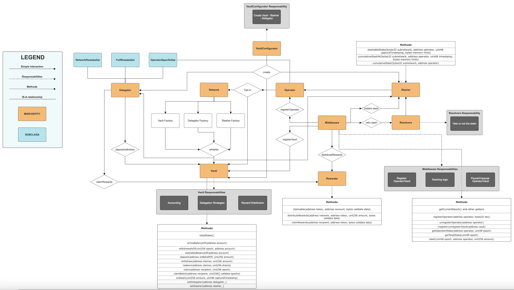

# Tanssi <> Symbiotic

## Description

This repo aims in creating an easy to run environment to spin up a local blockchain network allowing devs to interact with Symbiotic smart contracts.

It allows also to deploy a SimpleMiddleware contract that will be used to interact with the Symbiotic contracts.

## Architecture

The architecture can be seen in the following image



## Usage

### Install

```shell
$ make install
```

### Start

To spin up locally the blockchain network run:

```shell
$ make anvil
```

then to deploy symbiotic contracts:

```shell
$ make deploy
```

### Test

```shell
$ make test
```

### Format

```shell
$ make fmt
```

### Gas Snapshots

```shell
$ make snapshot
```

### Clean

```shell
$ make clean
```

### Remove

```shell
$ make remove
```
