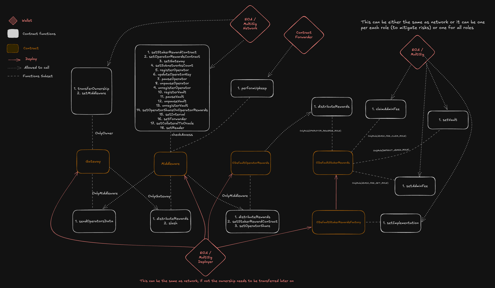

# Tanssi <> Symbiotic

## Description

This repo aims in creating an easy to run environment to spin up a local blockchain network allowing devs to interact with Symbiotic smart contracts.

It allows also to deploy a SimpleMiddleware contract that will be used to interact with the Symbiotic contracts.

This repository provides the necessary infrastructure for deploying and interacting with Symbiotic smart contracts. It includes:

- Symbiotic Contracts: The repository contains the deployment scripts for the core Symbiotic contracts.
- Middleware Contract: In addition to the Symbiotic contracts, the repository also includes a Middleware contract that can be used to interact with the Symbiotic system.
- Rewarder Contract: The repository also includes a Rewarder contract that can be used to distribute rewards to users who interact with the Symbiotic system.

By using this repository, developers can quickly set up the necessary environment for working with Symbiotic contracts, our Middleware and Rewarder.

## Usage

### Install

```shell
$ make install
```

### Start

To spin up locally the blockchain network run:

```shell
$ make anvil
```

#### Deploy Tanssi Ecosystem:

```shell
$ make deploy-tanssi-eco RPC_URL=${RPC_URL} PRIVATE_KEY=${PRIVATE_KEY}  ETHERSCAN_API_KEY=${ETHERSCAN_API_KEY}
```

### Demo

If you want to emulate the whole process of registering operators and vaults as in mainnet run the demo script:

```shell
$ make demo
```

### Test

```shell
$ make test
```

### Coverage

```shell
$ make coverage
```

### Format

```shell
$ make fmt
```

### Gas Snapshots

```shell
$ make snapshot
```

### Clean

```shell
$ make clean
```

If you encounter any issues after continuously deploying contracts, namely `MemoryOOG`, just run:

```shell
$ make clean-all
```

### Remove

```shell
$ make remove
```

### Add dependency

Run `forge install DEPENDENCY_TO_INSTALL --no-commit`.

### Update dependency version

`cd` into the dependency folder in `lib`, then run `git checkout XXXXX` where XXXXX is the wanted
commit/tag. Then return in the root folder and add the git submodule diff to your commit.

## Contracts' Ownership

Some contracts have modifiers that restrict the access to some functions. The diagram to explain the ownership of the contracts can be seen in the following image:


